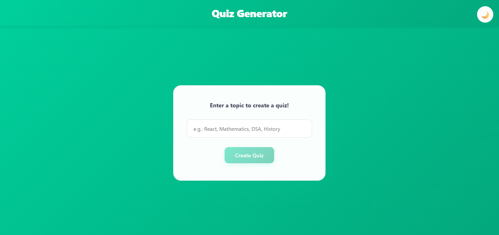
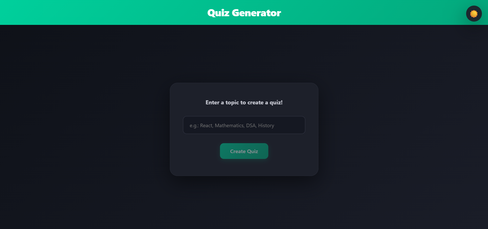
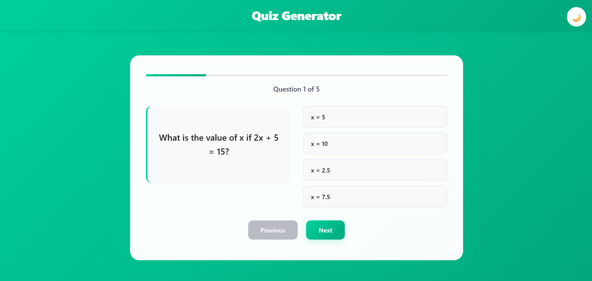
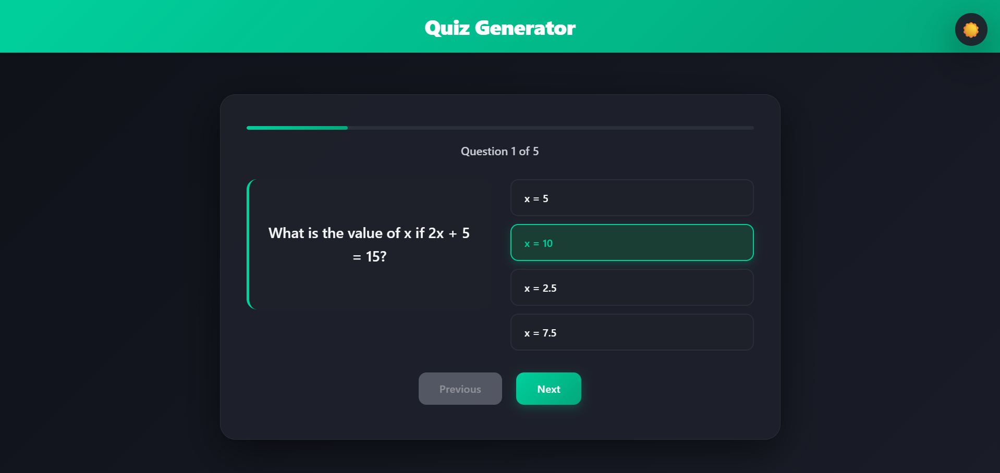
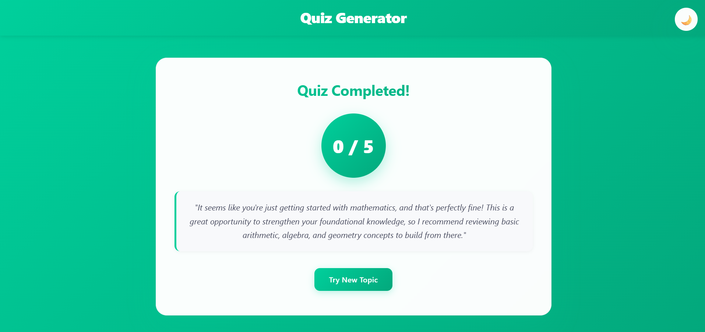
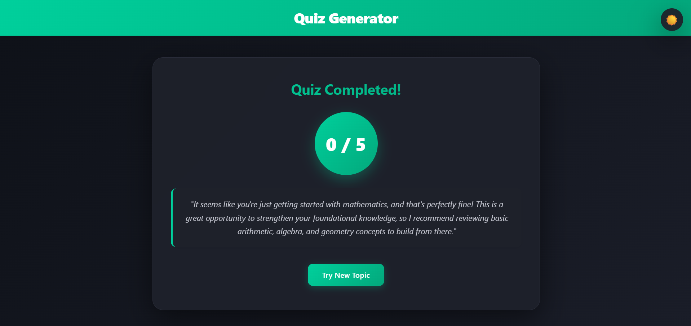

# 🎯 Quiz Generator

An AI-powered quiz application that generates custom quizzes on any topic using Google's Gemini AI. Built with React and featuring a modern, classy UI with light/dark theme support.


## ✨ Features

- 🤖 **AI-Powered Quiz Generation** - Create quizzes on any topic using Google Gemini AI
- 🎨 **Modern UI/UX** - Groww-inspired design with vibrant green gradients
- 🌓 **Light/Dark Theme** - Toggle between light and dark modes with persistent preferences
- 📱 **Responsive Design** - Works seamlessly on desktop and mobile devices
- 💡 **Smart Feedback** - Get personalized AI-generated feedback on your performance
- ⚡ **Real-time Progress** - Visual progress tracking through the quiz
- 🎯 **Interactive Quiz Layout** - Modern split-screen layout with questions on left, options on right

## 📸 Screenshots

### Home Screen
<!-- Add your screenshot here -->



### Quiz Screen
<!-- Add your screenshot here -->



### Results Screen
<!-- Add your screenshot here -->




## 🏗️ Architecture

### Technology Stack

- **Frontend Framework**: React 19.2.0
- **Build Tool**: Vite 7.2.4
- **AI Service**: Google Generative AI (Gemini)
- **Styling**: CSS with CSS Variables for theming
- **State Management**: React Context API

### Project Structure

```
QuizGenerator/
├── public/
│   └── favicon.svg              # Custom Q icon
├── src/
│   ├── components/
│   │   ├── TopicSelection.jsx   # Initial topic input screen
│   │   ├── Loader.jsx           # Loading state component
│   │   ├── QuizScreen.jsx       # Quiz interface with split layout
│   │   └── ResultScreen.jsx     # Results and AI feedback
│   ├── context/
│   │   └── QuizContext.jsx      # Centralized state management
│   ├── ai-service.js            # Gemini AI integration
│   ├── App.jsx                  # Main app component
│   ├── App.css                  # Global styles and theming
│   ├── main.jsx                 # App entry point
│   └── index.css                # Base styles
├── .env                         # Environment variables
└── package.json
```

### State Management

The application uses **React Context API** for centralized state management, providing:

- ✅ **Single Source of Truth** - All application state in one place
- ✅ **Separation of Concerns** - Business logic separated from UI components
- ✅ **Easy Testing** - Logic isolated in context provider
- ✅ **Scalability** - Easy to add new state or actions

**QuizContext** manages:
- Quiz flow state (start, loading, quiz, result)
- Topic and questions data
- User answers and scoring
- Theme preferences (light/dark)
- AI feedback loading states

## 🚀 Getting Started

### Prerequisites

- Node.js (v20.19.0 or >=22.12.0 recommended)
- npm or yarn
- Google Gemini API Key ([Get one here](https://aistudio.google.com/app/apikey))

### Installation

1. **Clone the repository**
   ```bash
   git clone https://github.com/SaalimMaliksGH/QuizGenerator.git
   cd QuizGenerator
   ```

2. **Install dependencies**
   ```bash
   npm install
   ```

3. **Set up environment variables**
   
   Create a `.env` file in the root directory:
   ```env
   VITE_GEMINI_API_KEY=your_api_key_here
   VITE_GEMINI_MODEL=gemini-1.5-flash
   ```

4. **Run the development server**
   ```bash
   npm run dev
   ```

5. **Open in browser**
   
   Navigate to `http://localhost:5173`

### Building for Production

```bash
npm run build
npm run preview
```

## 🎨 Design Philosophy

### Color Scheme (Groww-Inspired)

The app features a professional color palette inspired by Groww's branding:

**Light Theme:**
- Primary: Vibrant Green (#00d09c)
- Background: Clean white with green gradients
- Text: Dark grays for excellent readability

**Dark Theme:**
- Primary: Same vibrant green for consistency
- Background: Deep charcoal blues (#0e1118)
- Text: Light grays and whites

### UI/UX Refinements

1. **Fixed Header** - "Quiz Generator" always visible at the top in white
2. **Split Layout** - Question on left, options on right for modern feel
3. **Glass-morphism** - Cards with backdrop blur effects
4. **Smooth Animations** - Hover effects, transitions, and loading states
5. **Accessibility** - Proper contrast ratios and keyboard navigation

## 🤖 AI Prompts Used

### Quiz Generation Prompt

**Final Optimized Prompt:**
```
You are a quiz generator. Create 5 multiple-choice questions about "{topic}".
Requirements:
1. Return ONLY a valid JSON array.
2. Do not add any markdown formatting.
3. Format: [{"id": 1, "question": "...", "options": [], "correctAnswer": "..."}]
```

**Refinements Made to Achieve Perfect JSON Structure:**

1. **Initial Issue**: AI was wrapping JSON in markdown code blocks (```json ... ```)
   - **Solution**: Added explicit instruction "Do not add any markdown formatting"
   - **Result**: Clean JSON output without wrappers

2. **Parsing Challenge**: Inconsistent response formats
   - **Solution**: Implemented `.replace(/```json/g, "").replace(/```/g, "").trim()` to strip any markdown
   - **Result**: Robust parsing even with markdown remnants

3. **Structure Consistency**: Ensuring all questions follow exact schema
   - **Solution**: Provided explicit format template with required fields (id, question, options, correctAnswer)
   - **Result**: 100% consistent question structure

4. **Array Format**: Sometimes returning object instead of array
   - **Solution**: Emphasized "Return ONLY a valid JSON array" at the start
   - **Result**: Always returns array format

5. **Options Array**: Ensuring 4 options per question
   - **Solution**: Implicit in "multiple-choice questions" prompt
   - **Result**: Consistent 4-option format

**JSON Structure Achieved:**
```json
[
  {
    "id": 1,
    "question": "What is React?",
    "options": ["A library", "A framework", "A language", "A database"],
    "correctAnswer": "A library"
  },
  // ... 4 more questions
]
```

### Feedback Generation Prompt

**Final Optimized Prompt:**
```
The user just took a quiz on the topic: "{topic}".
They scored {score} out of {totalQuestions}.

Write a short, encouraging, and specific feedback paragraph (max 2 sentences).
- If the score is low, be supportive and suggest what to study.
- If the score is high, praise their specific knowledge in this field.
- Talk directly to the user ("You...").
```

**Refinements Made:**

1. **Brevity Control**: Limited to 2 sentences maximum
   - **Reason**: Keeps feedback concise and impactful
   
2. **Personalization**: Direct address with "You..."
   - **Reason**: Makes feedback feel personal and engaging

3. **Score-based Logic**: Different tone for different performance levels
   - **Reason**: Appropriate encouragement vs celebration

4. **Topic Reference**: Includes specific topic in context
   - **Reason**: Makes feedback relevant to what user studied

5. **Error Handling**: Fallback message for API failures
   - **Implementation**: `"Great effort! Keep practicing to improve your score."`
   - **Reason**: Ensures users always receive feedback

## 🛠️ Development Journey

### Key Iterations

1. **Initial Setup** ✅
   - Basic React app with Vite
   - Component structure
   - AI service integration

2. **UI Enhancement** ✅
   - Implemented Groww-inspired theme
   - Added light/dark mode toggle
   - Created custom gradient designs

3. **Layout Improvements** ✅
   - Moved header to fixed position
   - Implemented split-screen quiz layout
   - Enhanced mobile responsiveness

4. **State Management** ✅
   - Refactored to React Context API
   - Centralized business logic
   - Improved code maintainability

5. **Polish & Details** ✅
   - Custom favicon
   - Error handling for API limits
   - Loading states and animations


## 🚀 Potential Improvements

### Short Term
- [ ] Add quiz history/statistics
- [ ] Implement timer for timed quizzes
- [ ] Add difficulty level selection
- [ ] Support for different question types (true/false, fill-in-blank)
- [ ] Export quiz results as PDF

### Long Term
- [ ] User authentication and profiles
- [ ] Quiz sharing functionality
- [ ] Multiplayer quiz mode
- [ ] Custom quiz creation (manual mode)
- [ ] Analytics dashboard
- [ ] Multiple language support

### Technical Enhancements
- [ ] Add unit tests (Jest + React Testing Library)
- [ ] Implement E2E tests (Playwright/Cypress)
- [ ] Add error boundary components
- [ ] Implement service workers for offline support
- [ ] Add performance monitoring
- [ ] Optimize bundle size with code splitting


## 🤝 Contributing

Contributions, issues, and feature requests are welcome!

1. Fork the project
2. Create your feature branch (`git checkout -b feature/AmazingFeature`)
3. Commit your changes (`git commit -m 'Add some AmazingFeature'`)
4. Push to the branch (`git push origin feature/AmazingFeature`)
5. Open a Pull Request

## 👨‍💻 Author

**Saalim Malik**
- GitHub: [@SaalimMaliksGH](https://github.com/SaalimMaliksGH)

---

**Built with ❤️ using React**
